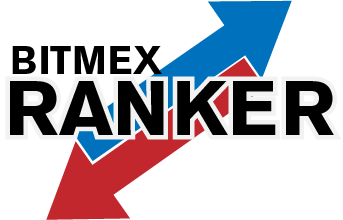

# Bitmex Ranker

See it in action here! http://www.robswc.me/bitmexranker

Bitmex Ranker (no affiliation with Bitmex.com) is an online webapp for following, analyzing and exploring the data from the top traders found on the Bitmex Leaderboards.

---

The official home of Bitmex Ranker can be found here:
bitmexranker.robswc.me

However, you can clone this repo and run a local version!

Any input, feedback or commits welcomed!

Report Issues via the Issues tab.

Common Questions and Answers can be found on the Wiki!
